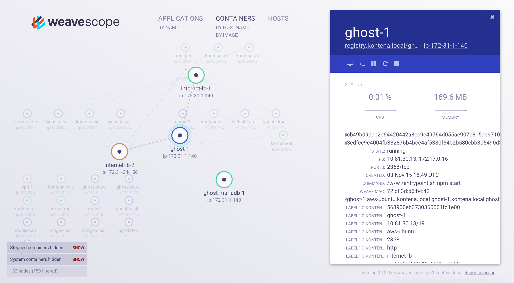

# Weave Scope on Kontena

> Prerequisites: You need to have working [Kontena](http://www.kontena.io) Container Platform installed. If you are new to Kontena, check [quick start guide](http://www.kontena.io/docs/getting-started/quick-start).   



## Deploy

**Step 1:** download [kontena.yml](kontena.yml)

**Step 2:** deploy Weave Scope 

```
$ kontena app deploy
```

## Accessing Weave Scope Web UI

- open Kontena VPN connection
- browse to http://weavescope-app.kontena.local:4040/
- enjoy :)
